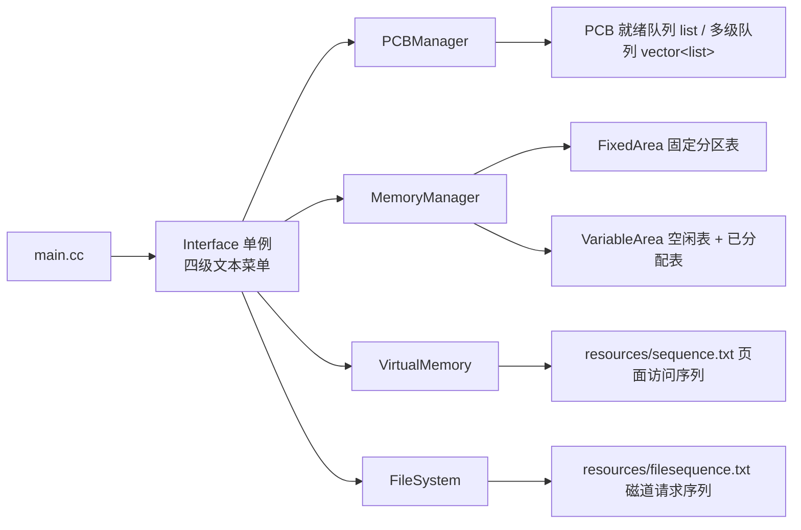

# operating-system-course-design

操作系统课程设计（C++，Linux）。一个命令行菜单程序，把课程里的四类经典算法做成可交互的模拟器：进程调度、内存分区管理、页面置换、磁盘调度。每个模块都是独立的类，用同一份菜单驱动；进程调度部分额外用 pthread 演示了多线程并发插入进程时动态优先级的重排。

## 模块与算法

| 模块 | 类 | 实现的算法 |
|---|---|---|
| 进程管理 | `PCBManager` / `PCB` | 先来先服务 FCFS、短作业优先 SJF、静态优先级、动态优先级、时间片轮转 RR、多级反馈队列 |
| 存储器管理 | `MemoryManager` / `FixedArea` / `VariableArea` / `Area` | 固定分区的分配与释放；可变分区的最佳适应分配，释放时前后空闲区合并 |
| 虚拟存储器 | `VirtualMemory` | 页面置换 FIFO、OPT、LRU，统计缺页次数并打印每步淘汰页 |
| 文件管理（磁盘调度） | `FileSystem` | 磁道调度 FCFS、SSTF 最短寻道优先、SCAN 电梯算法，输出服务顺序与总移动道数 |

## 核心架构



- `Interface` 负责全部交互：选模块、录入数据、选算法、循环回到上级菜单。算法类不做任何输入解析，只接收结构化参数并打印结果。
- 进程调度的输入是手工录入的 PCB（进程号、名称、优先级、运行时长），多级反馈队列有单独的插入入口，因为它要直接进入最高级队列。
- 页面置换与磁盘调度的输入序列从 `resources/` 读取，构造函数完成读入，切换算法不需要重新输入。

## 目录结构

| 路径 | 说明 |
|---|---|
| `src/main.cc` | 入口，取 `Interface` 单例并进入菜单；文件顶部保留了用 pthread 并发创建进程、测试动态优先级的函数 |
| `include/interface.hpp` | 菜单文案与分发逻辑 |
| `include/PCB.hpp`、`include/PCBManager.h`、`src/PCBManager.cc` | 进程控制块与六种调度算法 |
| `include/Area.h`、`include/FixedArea.hpp`、`include/VariableArea.hpp`、`src/MemoryManager.cc` | 分区结构、固定/可变分区表及分配释放算法 |
| `include/VirtualMemory.h`、`src/VirtualMemory.cc` | 三种页面置换算法 |
| `include/FileSystem.h`、`src/FileSystem.cc` | 三种磁道调度算法 |
| `resources/` | 页面序列与磁道序列的输入文件 |
| `Makefile` | 编译到可执行文件 `main`，中间产物放 `obj/` |

## 构建与运行

依赖：g++（支持 C++11）、pthread。

```bash
mkdir -p obj      # Makefile 不会自动创建目标目录
make              # 生成 ./main
./main
make clean
```

## 设计要点

- **动态优先级用「运行后重排」而不是每个时钟中断重算**：每调度一个进程后，其余等待进程的优先级按常量 `PRI_ADD` 增长，再按优先级排序，优先级相同时按到达时间保持 FCFS，兼顾防饥饿与实现简单。
- **时间片轮转直接在 `std::list` 上循环**：每个 PCB 扣减一个 `TIMER_CHIP` 时间片，未跑完的留在队尾，跑完的从队列删除并记录结束时间。
- **多级反馈队列的三级时间片递增**（20 / 40 / 60）：高优先级队列时间片短、响应快，一个时间片没跑完就降到下一级，最后一级退化为轮转。
- **可变分区用两张表 + 双向链表**：`VariableArea` 维护空闲表和已分配表；分配采用最佳适应，回收时通过 `Area` 的 `_prev/_next` 判断前后邻接空闲区，分三种情况合并，避免外碎片累积。
- **固定分区表写死六个不等长分区**（起始地址与长度在 `FixedArea.hpp` 常量里），演示「按大小挑第一个能放下的空闲分区」的经典做法。
- **OPT 需要「未来」信息**：`VirtualMemory::OPT` 向后扫描访问序列，淘汰下次使用距离最远的页，所以三种置换算法共用同一份预先读入的序列。
